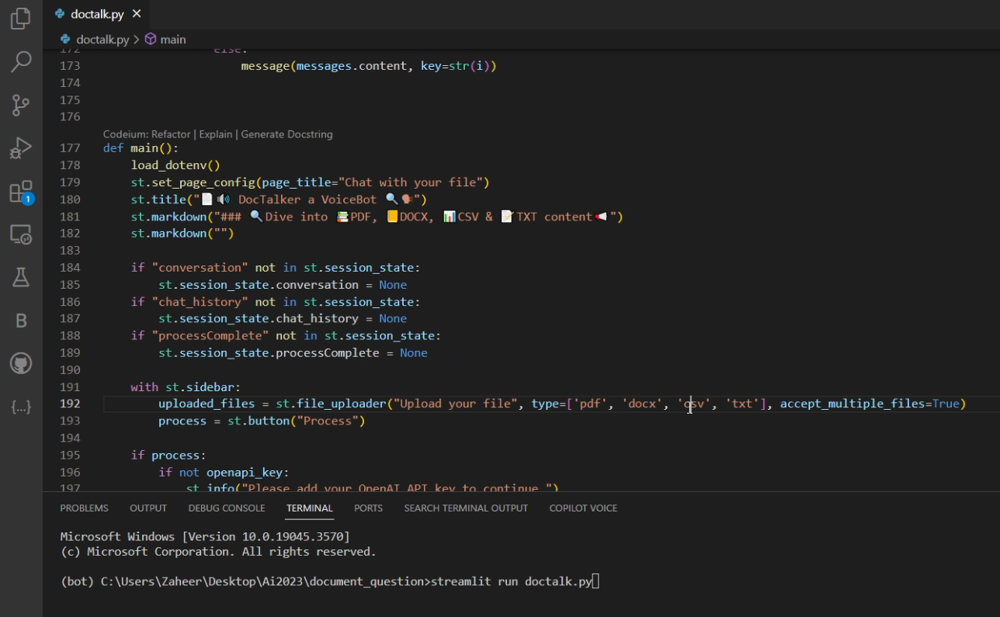
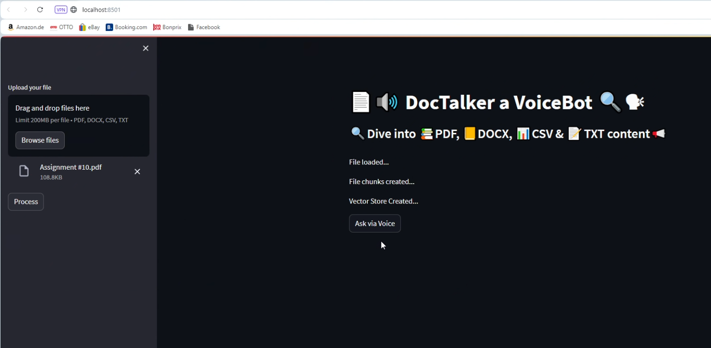
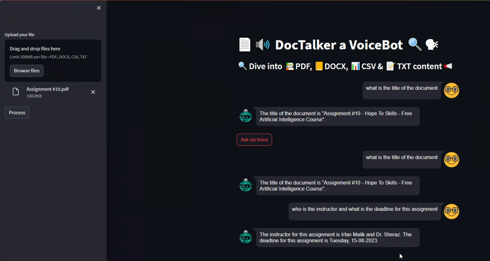
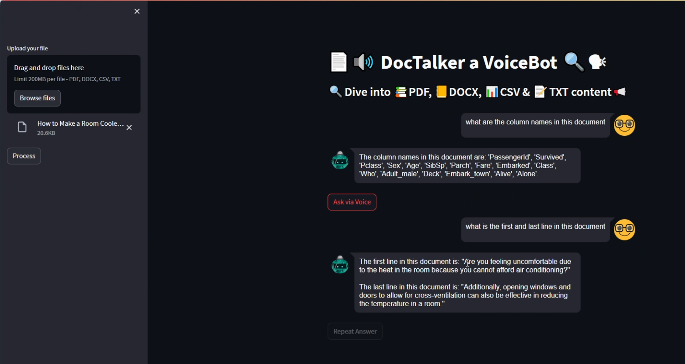

🚀 Happy to share my latest project, **DocTalker!** This cutting-edge **VoiceBot** integrates with Streamlit to turn your PDF, DOCX, CSV, and TXT files into a dynamic conversation. Using AI, it reads, processes, and interacts with your documents, making data retrieval as easy as chatting with a friend. 🗣️📄

**🔍 Features:**

**Voice commands** for querying document content

**Text-to-speech** functionality for an interactive experience

Supports **multiple document** formats

**Real-time processing** and **response generation**

💡 Developed using **Python**, **Streamlit**, **PyPDF2**, **docx**, **pandas**, and several **AI models** from **OpenAI** and **Hugging Face**, this application not only enhances document accessibility but also streamlines your workflow by allowing voice-driven interactions.

## Screenshot of the source code in an IDE showing a Python script titled 'doctalk.py', highlighting the main function and Streamlit UI setup code.

## User interface of the DocTalker VoiceBot application, displaying a file upload widget with an uploaded PDF file, and buttons indicating the types of files supported.

## Interface of the DocTalker VoiceBot after processing a document, showing responses to voice queries about the document's title and other metadata.

## Web application screen showing a detailed interaction with the DocTalker VoiceBot, including voice recognition responses about document content and structure.

